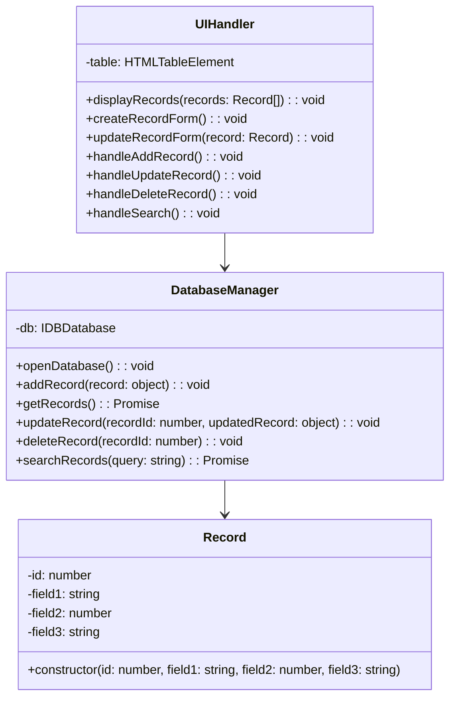
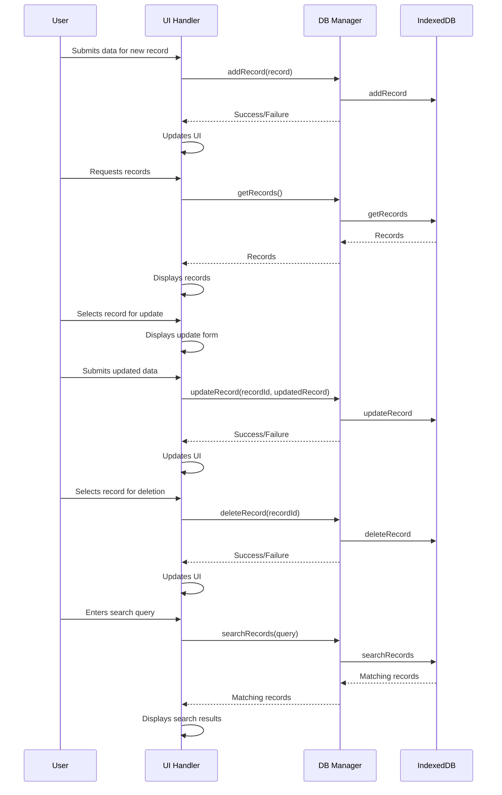

## Implementation approach

We will utilize the JavaScript framework, `vanilla JS` with `IndexedDB` for client-side SQLite functionality.  This approach allows for direct interaction with the browser's storage, enabling efficient data management and manipulation.  We will implement data validation and sanitization routines to ensure data integrity and security.  A user-friendly interface will be developed using HTML, CSS, and JavaScript.  The `IndexedDB` API will be leveraged for persistent storage, mimicking the functionality of a local SQLite database.

## File list

- index.html
- style.css
- script.js

## Data structures and interfaces

## Program call flow

## Anything UNCLEAR

Specific data types and constraints for the SQLite database are not defined.  Further details on the expected data volume and user base would be helpful.  Also, the security measures for client-side data management need to be further elaborated.  How will data validation and sanitization be implemented to prevent injection attacks?  What are the specific fields and data types for each record?  What are the expected constraints (e.g., length limits, data types)?  Defining these aspects will allow for a more robust and secure implementation.

